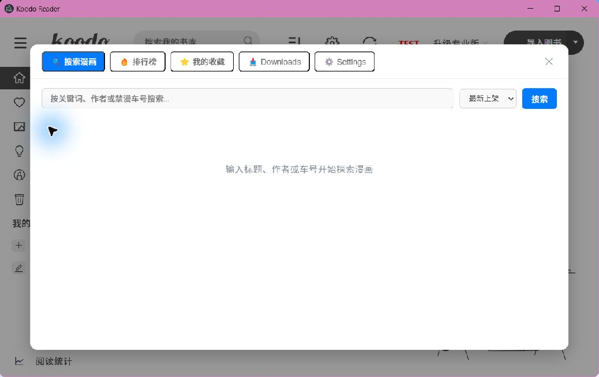

# Koodo Reader Personal

简体中文 | [English](./README.md)

Koodo Reader Personal 是一个独立维护、优先支持 Windows 的个人书库项目，衍生自 [Koodo Reader](https://github.com/koodo-reader/koodo-reader)，保留原项目的阅读和书库能力，并通过 [JMComic-Crawler-Python](https://github.com/hect0x7/JMComic-Crawler-Python) 提供内置桌面端在线漫画工作流。

本仓库不是 Koodo Reader 官方发行版。首个独立版本为 `v0.1.0`。

## 与上游的主要差异

- 内置 JMComic 桌面面板：搜索、排行、详情、账号登录、收藏夹、章节选择、下载、取消、CBZ 打包和自动入库。
- 维护 Personal 版本的书库多选和批量交互。
- 源码环境使用项目私有 `.venv`，固定 `jmcomic==2.7.5`。
- Windows 安装版和便携版内置 PyInstaller `onedir` sidecar，使用时不需要安装 Python。
- Personal、Personal 开发版与原 Koodo Reader 使用相互独立的本地数据目录。

在线漫画是桌面端能力，在 Web 构建中不会显示入口。

## 截图

### 在线漫画面板



## Windows 下载

请从 [GitHub Releases](https://github.com/roverstargazer1-max/koodo-reader-personal/releases/latest) 下载最新 NSIS 安装包或 portable EXE。每个 Release 同时提供 `SHA256SUMS.txt`。

`v0.1.0` 只支持 Windows 10/11 x64。当前构建未进行代码签名，Windows SmartScreen 可能显示“无法识别的应用”提示；运行前请核对 SHA-256。

## 源码快速启动

先安装 Git、Node.js 22、Python 3.12 x64 和 Corepack，然后执行：

```powershell
git clone https://github.com/roverstargazer1-max/koodo-reader-personal.git
cd koodo-reader-personal
corepack enable
yarn setup
yarn dev
```

`yarn setup` 会检查 Node/Yarn、严格按 `yarn.lock` 安装、创建根目录 `.venv`、安装完整 Python 运行时锁并执行 `check_env`。`yarn dev` 启动 React 和 Electron 前会再次检查环境。

开发环境基线：

- Node.js 22
- Yarn 1.22.22
- Python 3.12 x64
- Windows 10/11 x64

常用验证命令：

```powershell
yarn check:env
yarn test:jmcomic-runtime
yarn typecheck
yarn build
```

构建 sidecar、NSIS 安装包和便携版：

```powershell
yarn package:win
```

## 运行时结构

源码模式优先使用用户明确选择的兼容 Python，否则使用项目 `.venv`。系统 Python 只用于创建或修复 `.venv`。

打包模式固定启动：

```text
resources/jmcomic-bridge/jmcomic-bridge.exe
```

JavaScript 调度代码位于 `app.asar`；sidecar 由 electron-builder 的 `extraResources` 放在 ASAR 外。bridge 要求 JMComic `2.7.5`，版本不一致时 `check_env` 会返回可操作的错误。

## 数据目录与迁移

- Personal 正式版：`%APPDATA%\KoodoReaderPersonal`
- Personal 开发版：`%APPDATA%\KoodoReaderPersonal-dev`
- 为兼容现有同步继续使用云端目录：`KoodoReader`
- 为兼容现有链接继续使用深链协议：`koodo-reader://`

迁移时先在旧版中创建完整备份，再在 Koodo Reader Personal 中恢复。两个应用共用 `KoodoReader` 云同步目录时不要同时写入。详细步骤见[数据迁移](./docs/data-migration.md)。

## 环境排错

**`yarn dev` 提示环境缺失**

执行 `yarn setup`。如果找不到 Python，请安装 Python 3.12 x64，并确保 Python Launcher 可用。

**JMComic 版本不一致**

源码模式重新执行 `yarn setup`；打包模式从完整的 GitHub Release 重新安装，并核对校验和。

**看不到在线漫画入口**

该入口只在 Electron 桌面应用显示，Web 版本不包含此能力。

**安装版或便携版启动异常**

核对 `SHA256SUMS.txt`，确认下载文件完整，并检查安全软件是否隔离了 `resources\jmcomic-bridge` 下的文件。

## 已验证平台

发布流水线在 Windows Server 2022 x64 上验证 Node.js 22、Yarn 1.22.22、Python 3.12、React 生产构建、unpacked Electron 应用和打包 sidecar 的直接执行。Windows 10/11 x64 安装版与便携版冒烟测试是发布前验收项。

## 上游与许可证

本项目基于 Koodo Reader，并保留仓库根目录的 AGPL-3.0 许可证。JMComic-Crawler-Python 作为固定版本的 MIT 依赖使用，其源码没有复制进本仓库。详见[第三方声明](./THIRD_PARTY_NOTICES.md)和 [ADR 0003](./docs/adr/0003-reproducible-python-runtime-and-windows-sidecar.md)。

使用内容服务时，请遵守服务条款以及账号和所在地适用规则。
